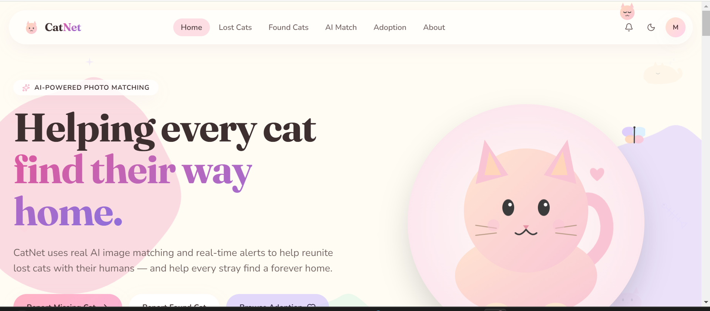
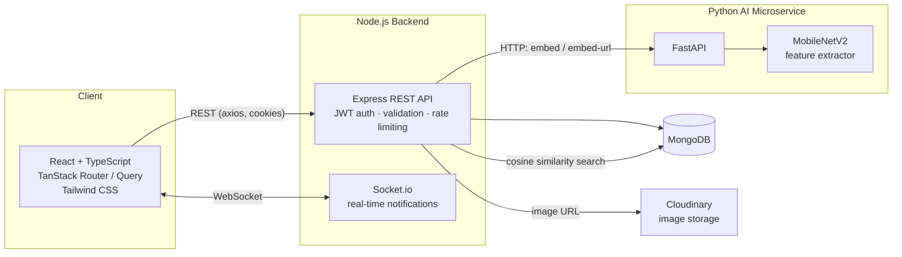

<div align="center">

# 🐱 CatNet

**Lost a cat. Found a cat. Match a cat — with AI.**

CatNet is a full-stack platform that helps communities reunite lost cats with their owners,
report found strays, and support cat adoption — powered by a real computer-vision
re-identification model, not a mock.

[Features](#-features) · [Architecture](#-architecture) · [AI Match](#-ai-match--the-headline-feature) · [Setup](#-getting-started) · [API](#-api-overview) · [Security](#-security) · [Roadmap](#-roadmap)

</div>

---


## 🎯 The Problem

Every year, thousands of cats go missing from their homes, and thousands more are found
wandering with no way to identify their owner. Existing "lost pet" solutions are usually
static Facebook posts or flyers — there's no way to actually **search by what the cat looks
like**. CatNet solves this with a photo-matching engine on top of a real-time social platform
built for lost, found, and adoptable cats.

## ✨ Features

| | |
|---|---|
| 🔍 **AI Match** | Upload a photo of a cat and instantly find visually similar Lost/Found posts, powered by a MobileNetV2 feature-extraction microservice — no login required, so someone who just found a cat on the street can search immediately |
| 📝 **Lost / Found / Adoption posts** | Create posts with photos, location, and contact info; full CRUD with ownership checks |
| 💬 **Comments, likes & saves** | Real social layer on every post |
| 🔔 **Real-time notifications** | Socket.io-powered live updates — comments, likes, and matches land instantly, no refresh |
| 🌗 **Dark mode** | Full light/dark theming across the app |
| 👤 **Profiles** | Public profile pages with a user's posts, editable bio/location, and profile photo upload |
| 🗺️ **Location-aware search** | Filter posts by location and full-text search on title/description |
| 🔐 **Real authentication** | JWT sessions in httpOnly cookies — not localStorage tokens |

## 🏗️ Architecture

CatNet is split into three independently deployable services, which is deliberate rather
than accidental complexity:



**Why a separate Python service instead of doing AI in Node?** TensorFlow doesn't belong in
a Node process — keeping it as its own FastAPI service means it can be scaled, redeployed, or
swapped for a better model independently of the main API, and the main API stays fast and
lightweight.

### Tech stack

**Frontend** — React 18, TypeScript, TanStack Router + Query, Tailwind CSS, Radix UI /
shadcn primitives, Axios, Socket.io-client, Vite

**Backend** — Node.js, Express, MongoDB (Mongoose), Socket.io, JWT (httpOnly cookies),
Cloudinary, Multer, Helmet, express-rate-limit, express-mongo-sanitize, express-validator

**AI Microservice** — Python, FastAPI, TensorFlow (MobileNetV2), Pillow, NumPy

## 🤖 AI Match — the headline feature

This is a **photo re-identification** system, not a classifier — there's no labelled
dataset of "these two photos are the same cat" to train on, so instead of training
something from scratch, CatNet uses **MobileNetV2** (pretrained on ImageNet) as a fixed
feature extractor:

1. Strip MobileNetV2's classification head, keep the convolutional base.
2. Run a cat photo through it and global-average-pool the output → a **1280-dimensional
   embedding** that captures the photo's visual content (fur pattern, coloring, shape,
   markings).
3. Two photos of the *same* cat produce embeddings that land close together in that space
   (measured by cosine similarity); different cats land farther apart.
4. No training step required — this is the same underlying idea as reverse image search
   and face-matching systems.

**How it's wired end-to-end:**
- Every time a Lost/Found post is created, its photo's embedding is computed and stored
  alongside it (best-effort — if the AI service is briefly down, the post still saves; it's
  just excluded from match results until edited).
- When someone uploads a search photo, the backend computes its embedding, compares it
  against up to 500 candidate posts in one pass, and returns the top 5 matches with a
  similarity score — the query photo itself is **never stored**, only its embedding, and
  only for that one comparison.
- Embeddings are excluded from every normal API response (`select: false` at the schema
  level) and only pulled in explicitly for the match query — the raw vectors never reach
  the client.


## 🔐 Security

Security was treated as a first-class requirement, not an afterthought:

- **JWT auth in httpOnly cookies** — not localStorage, so tokens aren't reachable by
  client-side JS/XSS
- **Helmet** for security headers, **express-rate-limit** on all API routes (tighter limits
  on auth endpoints to blunt brute-force attempts)
- **express-mongo-sanitize** to block NoSQL injection
- **Magic-byte file validation** — uploaded images are checked against their actual binary
  signature, not just the claimed MIME type, before being accepted
- **Ownership checks** on every mutation (edit/delete a post or comment only if you created
  it)
- **WebSocket authorization** — socket connections are authenticated and scoped so users
  only receive notifications meant for them

## 📁 Project Structure

```
CatNet/
├── frontend/          React + TanStack Router SPA
│   └── src/
│       ├── routes/        # file-based routes (lost, found, adoption, ai-match, profile...)
│       ├── components/    # cards, layout, ui primitives
│       ├── lib/           # typed API clients (posts, auth, users, notifications)
│       ├── context/       # AuthContext (session + socket)
│       └── hooks/
├── backend/           Express REST API + Socket.io
│   └── (controllers | routes | models | middleware | services | validators)/
└── ai-service/         FastAPI + MobileNetV2 microservice
    ├── main.py         # /health, /embed, /embed-url, /similarity
    └── model.py        # embedding + cosine similarity logic
```

## 🚀 Getting Started

### Prerequisites
- Node.js 18+
- Python 3.10+
- A MongoDB instance (local or Atlas)
- A Cloudinary account (free tier is fine)

### 1. AI Microservice
```bash
cd ai-service
pip install -r requirements.txt
uvicorn main:app --reload --port 8000
```

### 2. Backend
```bash
cd backend
npm install
cp .env.example .env   # fill in MONGO_URI, JWT_SECRET, CLOUDINARY_*, AI_SERVICE_URL
npm run dev
```

### 3. Frontend
```bash
cd frontend
npm install
npm run dev
```

Then visit the printed local URL — sign up, create a Lost/Found post, and try AI Match with
two different photos of the same (or different) cat to see the similarity scoring in
action.

## 📡 API Overview

| Method | Route | Description |
|---|---|---|
| `POST` | `/api/auth/signup` / `/login` / `/logout` | Auth |
| `GET`  | `/api/auth/me` | Current session |
| `GET`  | `/api/posts` | List posts (search, category, location, pagination) |
| `POST` | `/api/posts` | Create post (multipart, image upload) |
| `PUT` / `DELETE` | `/api/posts/:id` | Update / delete (owner only) |
| `POST` | `/api/posts/ai-match` | 🔍 Photo-based match search (public) |
| `POST` | `/api/posts/:id/like` \| `/save` | Toggle like / save |
| `GET`/`POST`/`PUT`/`DELETE` | `/api/posts/:id/comments` | Comments CRUD |
| `GET` | `/api/users/:id`, `/api/users/:id/posts` | Public profile |
| `PUT` | `/api/users/profile`, `/api/users/password` | Update own profile |
| `GET`/`PUT`/`DELETE` | `/api/notifications` | Real-time notification feed |

## 🗺️ Roadmap

- Fine-tune the embedding model with triplet loss once real confirmed-match data exists
- Vector index (Atlas Vector Search / FAISS) for AI Match at scale
- Push notifications (currently in-app + socket only)
- Map-based post discovery (Leaflet integration is scaffolded in the frontend)

## 👩‍💻 Author

Built by **Mounika** ([@KotapatiSaiMounika](https://github.com/KotapatiSaiMounika))

---

<div align="center">
<sub>Made with 🐾 for cats who can't fill out their own missing-person reports.</sub>
</div>
